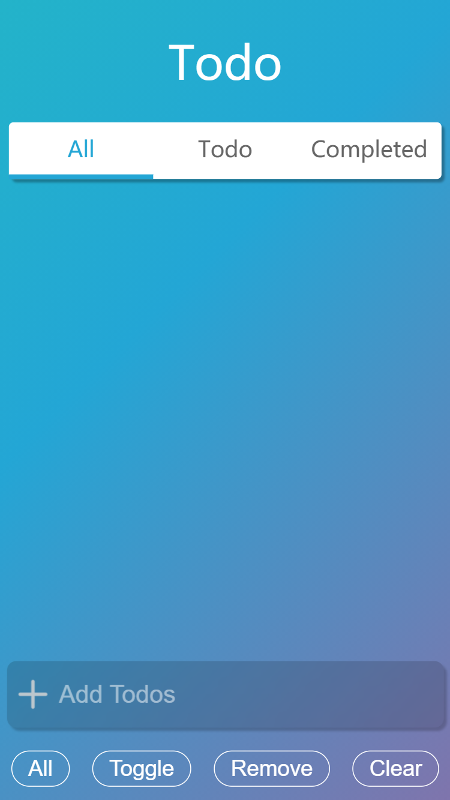
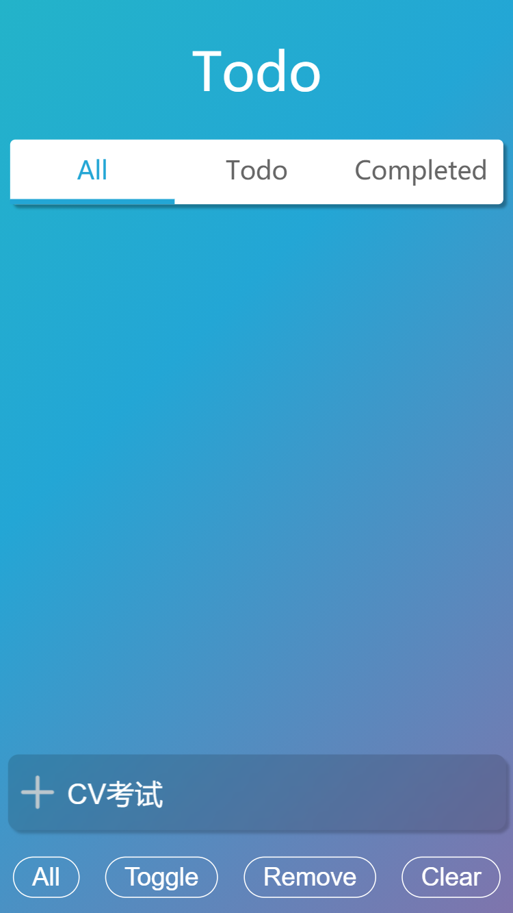
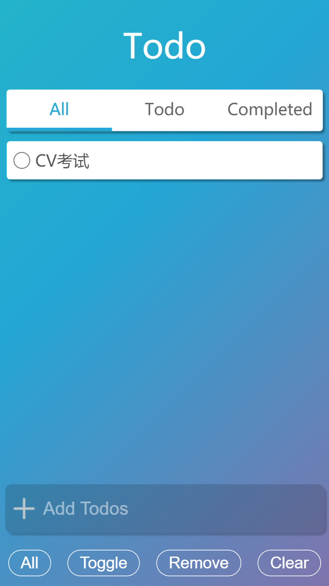
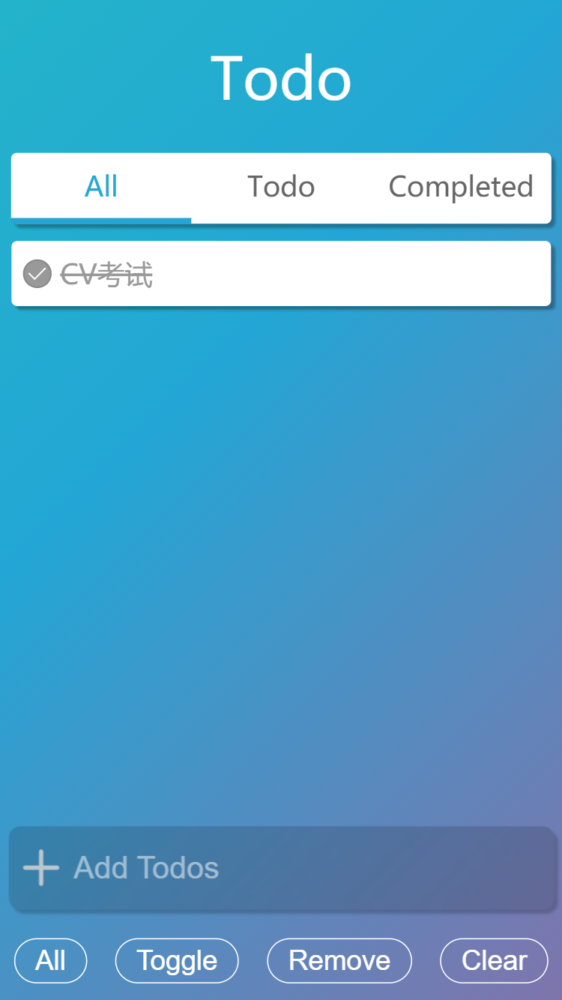
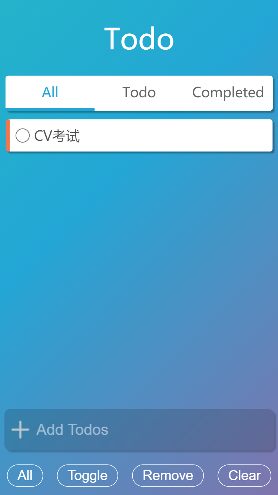
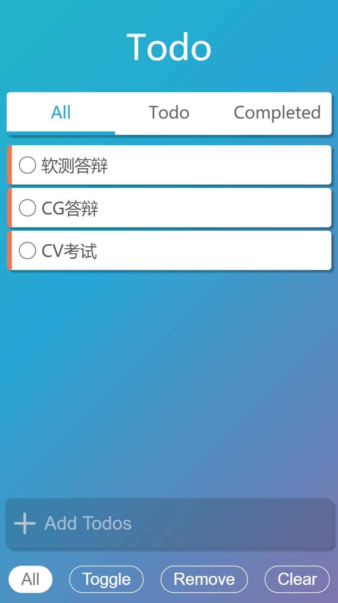
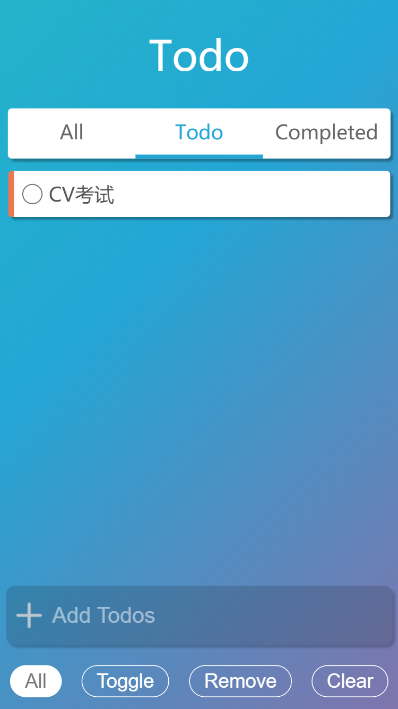
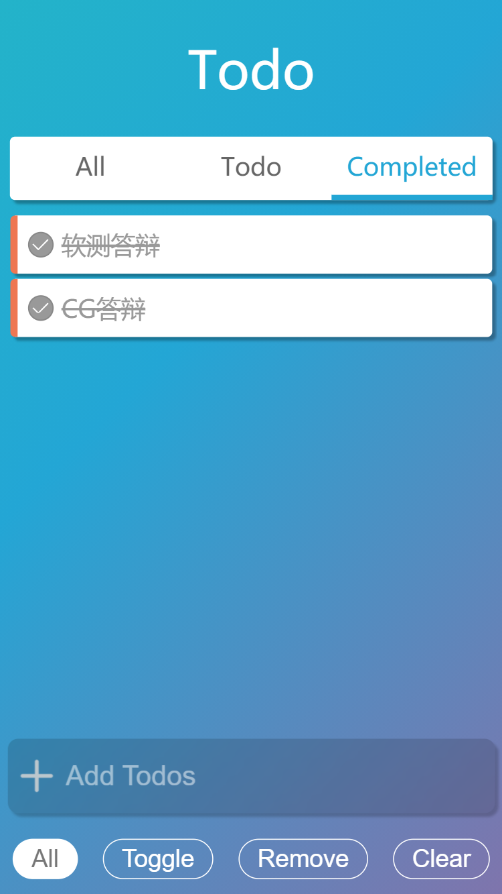
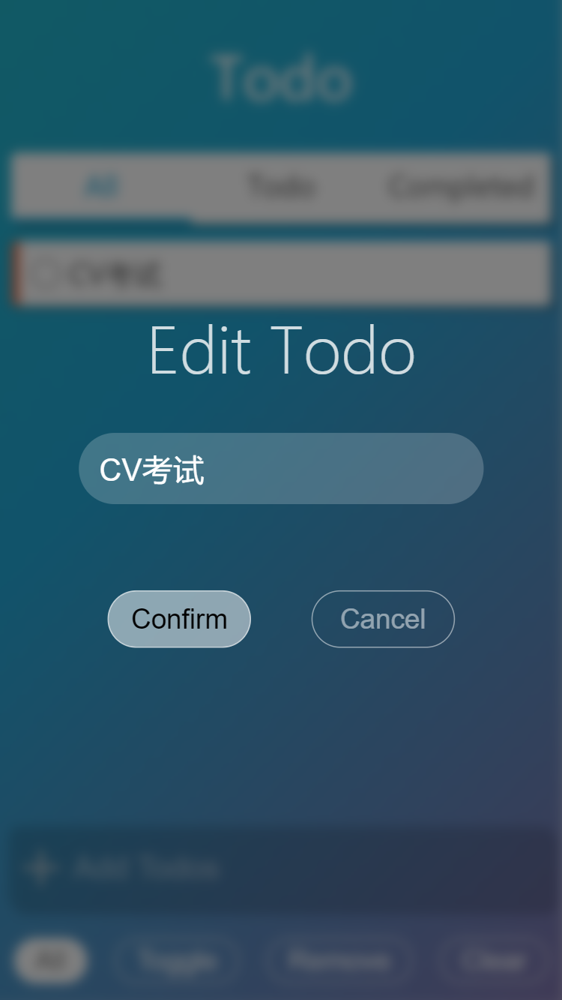

> * 学号：1851197
> * 姓名：周楷彬
> * Github地址：https://github.com/kb824999404/TodoMVC
> * 部署地址：https://ian824.xyz/TodoMVC/

---

## 项目介绍

[TodoMVC](http://todomvc.com/) 是一个开源项目，实现了一个 Todo List Application，它使用目前流行的不同JavaScript框架的来实现同一个Demo，来帮助你熟悉和选择最合适的前端框架。

**基础功能**

- [x] 新增todo
- [x] 删除todo
- [x] 展现todo列表
- [x] 全选，批量完成/取消
- [x] 删除已完成
- [x] 保存页面状态，刷新页面后可恢复

**高级功能**

- [x] 过滤 (All / Active / Completed)
- [x] 长按编辑单条todo，弹出对话框
- [x] 简洁优雅的Style

**功能亮点**

* `HTML`：
  * [x] 整体布局采用`flex`布局，能够适配不同屏幕大小的设备
  * [x] 标签基本采用`div`元素，避免默认的样式
* `JS`：
  * [x] 采用`button`模拟`checkbox`，`check`后修改背景图片
  * [x] 采用定时器实现长按，`touchstart`时启用定时器，`touchend`时停止定时器
  * [x] `dialog`实现，位置固定，默认情况下隐藏，编辑时显示；用全局变量存储当前编辑的`todo`的`id`
* `CSS`：
  - [x] 背景渐变效果
  - [x] 圆形`button`
  - [x] 边框圆角样式
  - [x] 阴影效果
  - [x] 对话框背景毛玻璃
  - [x] 过渡动画

---

## 功能展示

**初始界面**



**输入Todo**



**添加Todo**



**完成Todo**



**选择Todo**



**选择全部**



**过滤未完成Todo**



**过滤已完成Todo**



**修改Todo**



---

## 代码实现

**删除Todo**

```javascript
function removeTodo(id){
    var todoList = $('.Todo-List');
    var item = $('#' + id);
    todoList.removeChild(item);
    update();
}
```

**完成Todo**

```javascript
function toggleItem(id){
    var item = $('#' + id);
    var msg = item.querySelector('.Msg');
    var toggle = item.querySelector('.Toggle');
    if(toggle.value=="false"){
        item.classList.add(CL_COMPLETED);
        msg.classList.add(CL_COMPLETED);
        toggle .value = "true";
        toggle .classList.add("Toggle-Checked");
    }
    else{
        item.classList.remove(CL_COMPLETED);
        msg.classList.remove(CL_COMPLETED);
        toggle .value = "false";
        toggle .classList.remove("Toggle-Checked");
    }
    update();
}
```

**全选**

```javascript
function allSelected(isSelected){
    var items = $All('.Todo-List .List-Item');
    items.forEach((item)=>{
        if(isSelected)
            item.classList.add(CL_SELECTED);
        else   
            item.classList.remove(CL_SELECTED); 
    });
    update();
}
```

**批量完成**

```javascript
function toggleSelected(){
    var items = $All('.Todo-List .List-Item');
    items.forEach((item)=>{
        if(item.classList.contains(CL_SELECTED)&&!item.classList.contains(CL_COMPLETED)){
            var id  = item.id ;
            toggleItem(id);
        }
    });
    update();
}
```

**批量删除**

```javascript
function removeSelected(id){
    var items = $All('.Todo-List .List-Item');
    items.forEach((item)=>{
        if(item.classList.contains(CL_SELECTED)){
            var id  = item.id ;
            removeTodo(id);
        }
    });
}

```

**删除已完成**

```javascript
function clearCompleted(){
    var items = $All('.Todo-List .List-Item');
    items.forEach((item)=>{
        if(item.classList.contains(CL_COMPLETED)){
            var id  = item.id ;
            removeTodo(id);
        }
    });
}
```

**编辑Todo**

```javascript
function editTodo(id){
    var dialog = $('.Dialog');
    var item = $('#'+id);
    var msg = item.querySelector(".Msg");
    dialog.style.display = "";
    var input = dialog.querySelector(".Modify-Todo input");
    input.value = msg.innerText;

    currentEditID = id;
    dialog.querySelector('.Confirm').addEventListener('click',function(){
        msg.innerText = input.value;
        dialog.style.display = "none";
        update();
    })
}
```

**存储数据**

```javascript
function loadData(){
   var data_str = window.localStorage.getItem("TodoMVC");
   console.log(data_str);
   if(data_str){
       guid = 0;
       data = JSON.parse(data_str);
       data.forEach((todo)=>{
            var msg = todo.msg;
            var completed = todo.completed;
            addTodo(msg);
            if(completed)
                toggleItem("item"+(guid-1));
       })
   }
}


function saveData(){
    var items = $All('.Todo-List .List-Item');
    var data = []
    items.forEach((item)=>{
        var msg = item.querySelector('.Msg').innerText;
        var completed = item.classList.contains(CL_COMPLETED);
        data.push({
            msg:msg,
            completed:completed
        });
    });
    window.localStorage.setItem("TodoMVC",JSON.stringify(data));
}
```